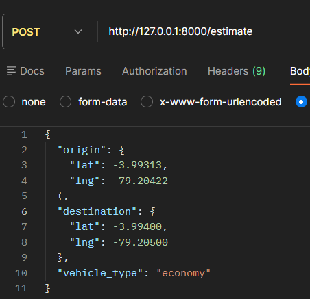
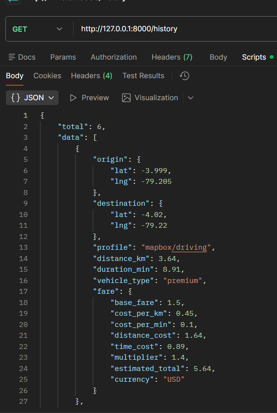
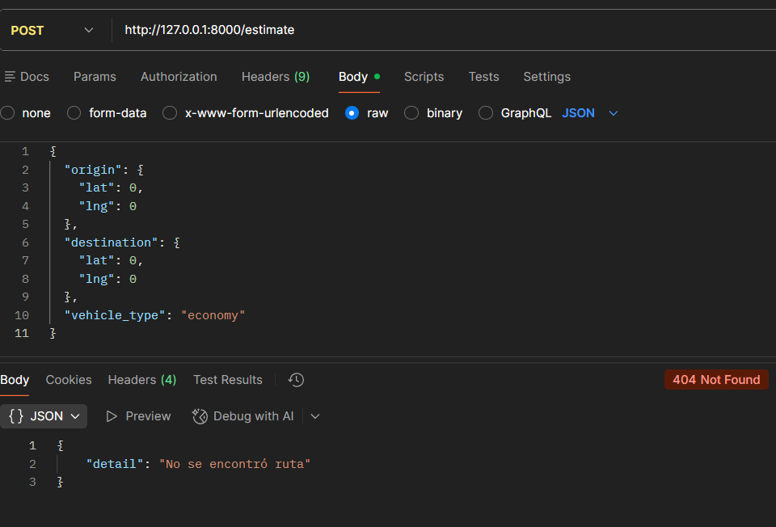

# 🚗 Ride Fare API con FastAPI + Mapbox

## 🎯 Objetivo

Diseñar y construir un API REST funcional que permita estimar el costo de un viaje tipo Uber, aplicando buenas prácticas de desarrollo, validación de datos e integración con servicios externos.

---

## 🚀 Tecnologías utilizadas

* Python (FastAPI)
* Uvicorn
* Mapbox Directions API
* Requests
* Python Dotenv
* GitHub
* Postman / curl
  
---

## 📂 Estructura del proyecto

```
Ejercicio_2/
│── app/
│   ├── __init__.py
│   ├── main.py
│   ├── models.py
│   ├── services.py
│   └── config.py
│── requirements.txt
│── .env
│── README.md
│── screenshots/
```
---

## ⚙️ Funcionalidades del API

El API permite estimar viajes con las siguientes características:

* ✅ Cálculo de distancia entre dos puntos
* ✅ Estimación de duración del viaje
* ✅ Cálculo de costo dinámico
* ✅ Soporte para múltiples tipos de vehículo
* ✅ Validación de datos con Pydantic
* ✅ Respuestas en formato JSON
* ✅ Integración con API externa (Mapbox)
* ✅ Historial de consultas

---

## 🔗 Endpoints disponibles

| Método | Endpoint      | Descripción             |
| ------ | ------------- | ----------------------- |
| GET    | /             | Información del API     |
| GET    | / health      |Verifica estado del API  |
| POST   | / estimate    | Calcula costo del viaje |
| GET    | / history     | Historial de consultas  |

---

## ▶️ Ejecución del proyecto

### Crear entorno virtual

```bash
python -m venv venv
```
### Activar entorno

```bash
venv\Scripts\activate
```
### Instalar dependencias

```bash
pip install -r requirements.txt
```
### Ejecutar API

```bash
uvicorn app.main:app –reload
```
---
## 🌐 Acceso

* http://127.0.0.1:8000
---

##🧪 Pruebas con Postman / curl

### Endpoint principal

* POST http://127.0.0.1:8000/estimate
  
### Body de ejemplo

```bash
{
  "origin": {
    "lat": -3.99313,
    "lng": -79.20422
  },
  "destination": {
    "lat": -4.00889,
    "lng": -79.21076
  },
  "vehicle_type": "economy"
}
```

### Respuesta esperada

```bash
{
  "distance_km": 3.18,
  "duration_min": 8.74,
  "vehicle_type": "economy",
  "fare": {
    "estimated_total": 3.8,
    "currency": "USD"
  }
}
```
---

## 📸 Evidencia de funcionamiento del sistema - Prueba en Postman

### 1. Post: http://127.0.0.1:8000/estimate

 
 
 
 
---

### 2. Post: http://127.0.0.1:8000/estimate | Error

 

---

### 3. Get: http://127.0.0.1:8000/history

 
 
---

## ⚠️ Manejo de errores

El API maneja correctamente:

* ❌ Token de Mapbox faltante → 500
* ❌ Ruta no encontrada → 404
* ❌ Error en API externa → 502
* ❌ Datos inválidos → 422
  
---

## 💡 Mejoras implementadas

* Integración con Mapbox Directions API
* Cálculo dinámico de tarifas
* Soporte para múltiples tipos de vehículo
* Historial de consultas
* Validación estructurada de datos
* Arquitectura modular del proyecto
  
---

## 🧠 Conclusión

Se logró construir un API REST funcional que integra un servicio externo real, permite estimar costos de viaje y cumple con los requisitos del ejercicio aplicando buenas prácticas de desarrollo y pruebas.

---
## 👨‍💻 Equipo de desarrollo
- **Erick Cárdenas**
- **Santiago Bravo**
- **Manuel Vicente**

---
Pregunta para el trabajo final:

¿Cómo podría un atacante manipular estos parámetros  para generar un consumo excesivo de la API de Mapbox a través de tu servicio, y qué impacto tendría esto en términos de costos y disponibilidad del sistema?

El endpoint /estimate representa un punto crítico dentro del API, ya que actúa como intermediario directo entre el usuario y el servicio externo de Mapbox. Esta arquitectura, aunque es eficiente para obtener datos en tiempo real, también abre la posibilidad de que un atacante abuse del sistema mediante la automatización de solicitudes. Al manipular los parámetros de entrada, como coordenadas o tipo de vehículo, y generar múltiples peticiones de forma masiva, el atacante puede provocar un consumo excesivo de la API externa sin necesidad de vulnerar directamente la infraestructura del servidor.

El impacto de este tipo de ataque es principalmente económico y operativo. Por una parte, el incremento descontrolado de solicitudes genera costos elevados debido al modelo de facturación por uso de Mapbox. Por otra parte, puede ocasionar la saturación del servicio o el agotamiento de los límites permitidos, lo que deriva en la pérdida de disponibilidad para usuarios legítimos. Existe el riesgo de que la API key sea suspendida por actividad sospechosa. Este escenario demuestra cómo una funcionalidad aparentemente segura puede convertirse en un vector de ataque indirecto, afectando la sostenibilidad y confiabilidad del sistema.


